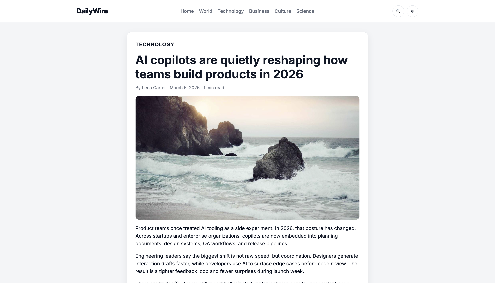
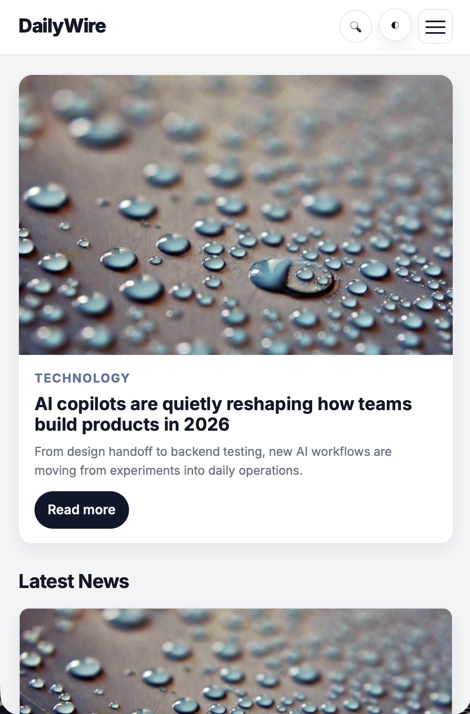

# DailyWire — Modern News Website

DailyWire is a modern, responsive news website built with HTML, CSS, and Vanilla JavaScript. It renders content dynamically from a JSON data source and includes category filtering, search, and a polished reading experience.

## Live Demo

https://erenb1lge.github.io/dailywire-news/

## Screenshots







## Features

- Responsive layout for desktop, tablet, and mobile
- Dynamic news rendering from JSON
- Category filtering (Home, World, Technology, Business, Culture, Science)
- Article detail pages with URL query parameters
- Search functionality with live filtering
- Dark mode toggle with saved preference
- Reading time estimation on article pages
- Scroll progress bar on article pages
- Loading skeleton UI while fetching data
- Accessibility improvements (ARIA states, keyboard support, visible focus states)

## Tech Stack

- HTML5
- CSS3
- Vanilla JavaScript
- JSON data source

## Project Structure

```text
dailywire-news/
├── index.html
├── article.html
├── 404.html
├── css/
│   └── style.css
├── js/
│   └── main.js
├── data/
│   └── articles.json
├── assets/
│   └── images/
├── screenshots/
├── LICENSE
└── README.md
```

## How to Run Locally

1. Open a terminal in the project root:

```bash
cd dailywire-news
```

2. Start a local server:

```bash
python3 -m http.server 8000
```

3. Open the app in your browser:

```text
http://localhost:8000/
```
